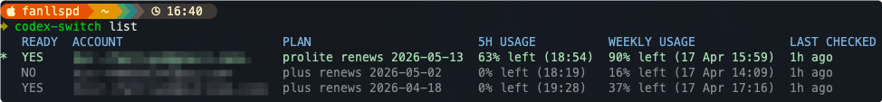

# codex-switch

Go CLI for saving, switching, refreshing, and inspecting local Codex ChatGPT login sessions.



## Build

```bash
make build
./bin/codex-switch -h
```

## Common commands

```bash
./bin/codex-switch login
./bin/codex-switch login work --force
./bin/codex-switch save work
./bin/codex-switch use work
./bin/codex-switch use work --relaunch
./bin/codex-switch use work --relaunch --force
./bin/codex-switch hermes save work
./bin/codex-switch hermes use work
./bin/codex-switch list
./bin/codex-switch current
./bin/codex-switch threads
./bin/codex-switch threads --source appserver
./bin/codex-switch sync --all
./bin/codex-switch token-info
./bin/codex-switch doctor
```

## Relaunch after switch

If you want the desktop app to pick up the newly switched account immediately:

```bash
./bin/codex-switch use work --relaunch
```

To force-close and reopen the Codex app during the relaunch flow:

```bash
./bin/codex-switch use work --relaunch --force
```

`--force` only works together with `--relaunch`.

When active Codex threads are detected, the CLI shows them and asks for an extra confirmation before relaunching.

## Hermes accounts

Hermes keeps its own Codex OAuth state in `~/.hermes/auth.json`, separate from Codex CLI's `~/.codex/auth.json`.

Use the `hermes` subcommands when you want to save or switch the Codex account used by Hermes without changing the account used by the Codex CLI:

```bash
./bin/codex-switch hermes save work
./bin/codex-switch hermes use work
./bin/codex-switch hermes list
./bin/codex-switch hermes current
```

`hermes save <name>` copies the current Hermes Codex provider state from `~/.hermes/auth.json` into `~/.hermes/accounts/<name>.json`.
Use `--force` to overwrite an existing Hermes alias:

```bash
./bin/codex-switch hermes save work --force
```

`hermes use <name>` switches only the Hermes auth file. It preserves any non-Codex providers already stored in `~/.hermes/auth.json`.

Hermes commands also understand Codex saved aliases from `~/.codex/accounts`. If `~/.hermes/accounts/<name>.json` does not exist yet, `hermes use <name>` can import a compatible `~/.codex/accounts/<name>.json` automatically, then switch Hermes to that account. A Codex alias must include both `access_token` and `refresh_token` to be considered importable.

`hermes list`, `hermes current`, shell completion, and `hermes use <name>` read the union of saved Hermes snapshots and importable Codex aliases.
Saved Hermes account snapshots are stored in `~/.hermes/accounts`.
Set `HERMES_HOME` if your Hermes installation uses a different home directory:

```bash
HERMES_HOME=/path/to/hermes ./bin/codex-switch hermes list
```

After `hermes use`, the CLI restarts the Hermes gateway so long-running Hermes processes pick up the new account. It prefers `systemctl --user restart hermes-gateway.service` when the user systemd service exists; if that service is not installed, it falls back to `hermes gateway restart`.

## Active threads

List active local Codex threads from the local state/session data:

```bash
./bin/codex-switch threads
```

You can also query the Codex app-server view:

```bash
./bin/codex-switch threads --source appserver
```

The `appserver` source requires a working `codex` binary. Resolution order:

1. `CODEX_SWITCH_CODEX_BIN`
2. `codexBin` in `~/.codex/codex-switch.json`
3. `codex` found in `PATH`

Accuracy notes:

- `threads` is a best-effort activity detector, not a source of absolute truth.
- `--source local` infers activity from local state/session files and recent task events, so it can miss threads if local metadata is stale or incomplete.
- `--source appserver` depends on what the running Codex app-server reports, and can differ from local file-based results.
- Both sources use a recent-activity time window, so very new, very old, or just-finished threads may be classified differently than what you see in the UI.
- Treat the output as a safety warning before relaunching or switching, not as a strict guarantee that no work is in progress.

## Shell completion

Install zsh completion for the current user:

```bash
./bin/codex-switch install-completion zsh
```

If your `~/.zshrc` does not already configure completions:

```bash
echo 'fpath=(~/.zsh/completions $fpath)' >> ~/.zshrc
echo 'autoload -U compinit && compinit' >> ~/.zshrc
source ~/.zshrc
```

## Config

Config file path:

```text
~/.codex/codex-switch.json
```

The tool auto-creates this file on first run.

Refresh uses the `client_id` inferred from the current local login token when available, and falls back to `network.refreshClientID` only if inference is unavailable.

Example:

```json
{
  "codexBin": "/Users/you/.local/bin/codex",
  "refresh": {
    "margin": "5d"
  },
  "network": {
    "usageURL": "https://chatgpt.com/backend-api/wham/usage",
    "subscriptionURL": "https://chatgpt.com/backend-api/subscriptions",
    "usageTimeoutSeconds": 6,
    "maxUsageWorkers": 8,
    "refreshURL": "https://auth.openai.com/oauth/token",
    "refreshClientID": "",
    "refreshTimeoutSeconds": 8
  }
}
```

Notes:

- `network.subscriptionURL` controls the subscription lookup used to enrich the displayed plan in `list` / `current`.
- `codexBin` is only needed when `threads --source appserver` cannot find `codex` in `PATH`.
- Set `CODEX_SWITCH_DEBUG_SUBSCRIPTION=1` to print subscription request/response diagnostics to stderr.
